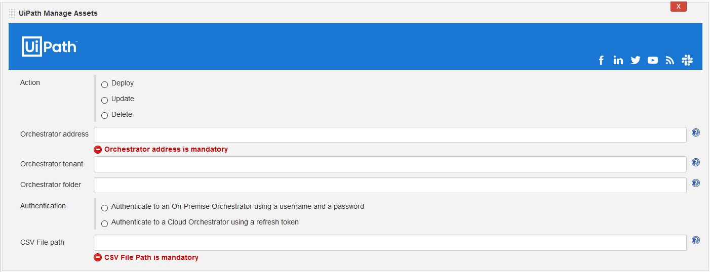
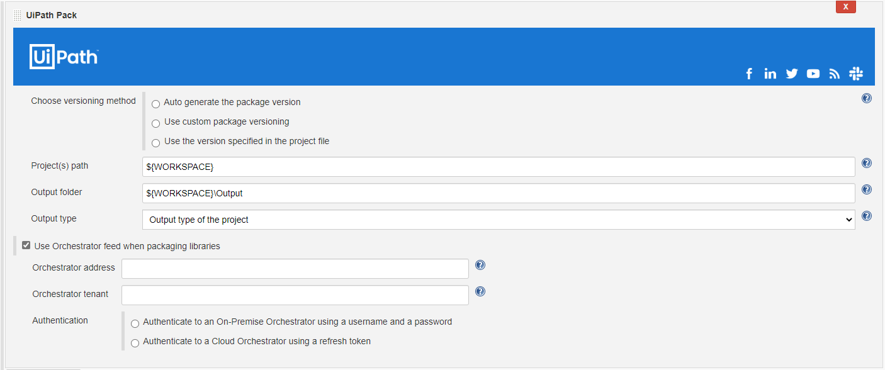
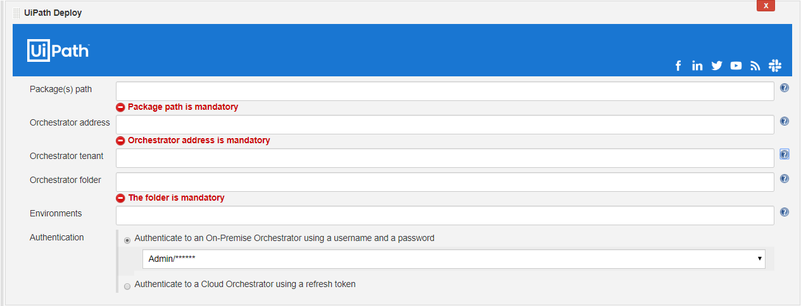
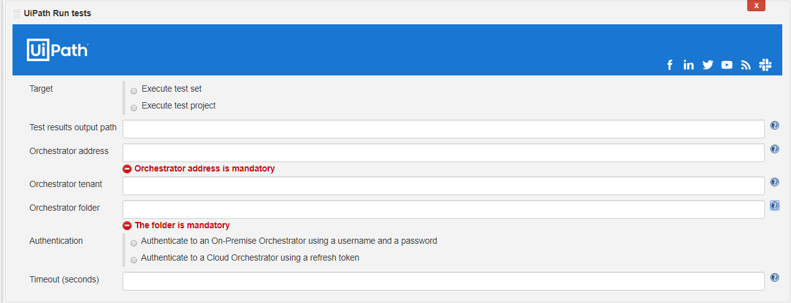
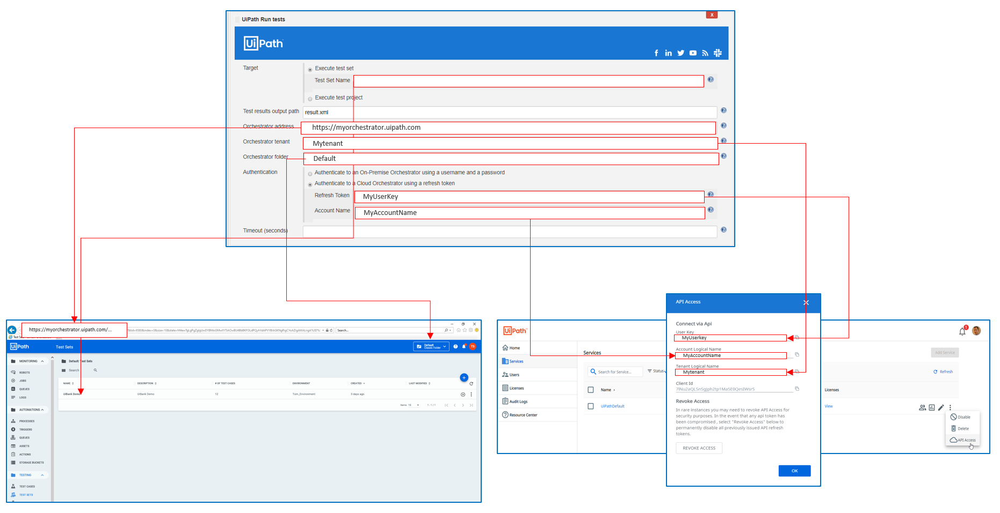

UiPath Jenkins Plugin
====================

[](https://plugins.jenkins.io/uipath-automation-package)
[](https://github.com/jenkinsci/uipath-automation-package-plugin/releases/latest)
[](https://plugins.jenkins.io/uipath-automation-package)

## About this plugin

This plugin allows you to build and deploy UiPath automation processes, as well as run UiPath automated test cases.

In order to pack projects created with UiPath Studio starting from 20.10, you need to use a version starting from 2.1 of this extension.

## Prerequisites

* Jenkins server running on Windows or Linux
* At least one Jenkins slave running on Windows (required for step execution)
* Orchestrator instance (basic, federated or cloud authentication are supported)
  * Testing features require Orchestrator version 20.4 or newer
  * When using an on-premise Orchestrator under HTTPS, make sure to import the SSL Certificate so that the HTTPS calls to Orchestrator can be trusted

## Installing and enabling the plugin

The Jenkins plugin can be installed from any Jenkins installation connected to the Internet using the **Plugin Manager** screen.

## Steps
### ▶ UiPath Run Job

The `UiPath Run Job` post-build step starts an already deployed process on an Orchestrator instance. The processes this task refers to are found in `Automations->Processes` on newer versions of Orchestrator and directly on the `Processes` tab on older versions of Orchestrator.

[](.github/run-job.png)

**⚙️ Configuration**

| Argument                      | Description           |
| ----------------------------- | -------------         |
| Process                       | (Required) Process name. You can take the process name from the Orchestrator UI. If the process is deployed in a Modern Folder then this argument should be the `NAME` of the process in the Processes tab. If the process is deployed in a Classic Folder, then the argument must be formed by the `NAME` of the process and the `ENVIRONMENT` (eg: NAME: `ProcessA` ENVIRONMENT: `Production` ProcessName: `ProcessA_Production`). |
| Parameters                    | The full path to a json input file. This is used when the Process requires input. |
| Priority                      | The job run priority. |
| Strategy                      | Specify the job run strategy, dynamically allocated job(s) or robot specific job(s). Options: `Allocate dynamically`, `Specific robots` |
| Orchestrator address          | The address of the Orchestrator instance where we'll run the process. |
| Orchestrator tenant           | Specify the Orchestrator tenant. |
| Orchestrator folder           | Specify the folder where the specified process was deployed. |
| Authentication                | For authentication towards Orchestrator, credentials have to be created in Jenkins upfront. There are 2 options to authenticate: *(1)* Authenticate to an On-Premise Orchestrator using username and password *(2)* Authenticate to a Cloud Orchestrator using a refresh token (API key). The account name and API key are accessible via Services->API Access (see below for a detailed explanation on how to retrieve this). |
| Job results output path       | Specify the output full path of the job results, e.g. testResults.json. The results are outputted in json format. If not specified, the results are outputted to the artifact staging directory as UiPathResults.json. The output is in json format. |
| Timeout                       | Specify the job run(s) timeout in seconds. |
| Fail when job fails           | The task fails when at least one job fails. (default true) |
| Wait for job completion       | Wait for job run(s) completion. (default true) |
|                               | **Parameters used for strategy `Allocate dynamically`** |
| No. of jobs                   | The number of job runs. (default 1) |
| User                          | The name of the user. This feature is available only on modern folders! This should be a machine user, not an orchestrator user. For local users, the format should be MachineName\\UserName |
| Machine                       | The name of the machine. This feature is available only on modern folders! |
|                               | **Parameters used for strategy `Specific robots`** |
| Robot names	                  | Comma-separated list of specific robot names. |

**📖 Pipeline example:**

```Groovy
pipeline {
  agent any
  environment {
      MAJOR = '1'
      MINOR = '0'
  }
  stages {
    stage ('Build') {
        UiPathRunJob(
          credentials: UserPass('825c83c9-9a14-44eb-883a-af54f8078af0'),
          failWhenJobFails: true,
          folderName: 'A_Classic',
          orchestratorAddress: 'https://testorchestrator.some-domain.com',
          orchestratorTenant: 'Default',
          parametersFilePath: '',
          priority: 'Low',
          processName: 'ProcessA_EnvB',
          resultFilePath: 'output.json',
          strategy: Dynamically(jobsCount: 1, machine: 'TestMachine', user: 'TestUser'), timeout: 3600, waitForJobCompletion: true
        )
        UiPathRunJob(
          credentials: UserPass('825c83c9-9a14-44eb-883a-af54f8078af0'),
          failWhenJobFails: true,
          folderName: 'A_Classic',
          orchestratorAddress: 'https://testorchestrator.some-domain.com',
          orchestratorTenant: 'Default',
          parametersFilePath: '',
          priority: 'Low',
          processName: 'ProcessA_EnvB',
          resultFilePath: 'output.json',
          strategy: Robot('robot1,robot2'),
          timeout: 1800,
          waitForJobCompletion: false
        )
    }
  }
}
```

### 💼 UiPath Manage Assets

The `UiPathManageAssets` step enables you to deploy, update or delete assets on an
Orchestrator instance. In order to deploy assets you must describe them in a
CSV file like the one in the example below.

```csv
name,type,value
asset_1_name,text,asset_value   # we can have comments
asset_2_name,integer,123
asset_3_name,boolean,false
asset_4_name,credential,"username::password"
```

There are 4 types of assets `text`, `integer`, `boolean` and `credential`. For 
the credential you must encode the username and password by using `::` to
separte the two fields.

[](.github/assets.png)

**⚙️ Configuration**

| Argument                      | Description           |
| ----------------------------- | -------------         |
| Action                        | What to do with the provided assets: deploy or delete. If a deployed asset exists then it will be updated instead.|
| Orchestrator address          | The address of the Orchestrator instance where we'll deploy or update assets. |
| Orchestrator tenant           | Specify the Orchestrator tenant onto which the assets will be deployed or updated. |
| Orchestrator folder           | Specify the folder where assets will be deployed or updated. |
| Authentication                | For authentication towards Orchestrator, credentials have to be created in Jenkins upfront. There are 2 options to authenticate: *(1)* Authenticate to an On-Premise Orchestrator using username and password *(2)* Authenticate to a Cloud Orchestrator using a refresh token (API key). The account name and API key are accessible via Services->API Access (see below for a detailed explanation on how to retrieve this). |
| CSV File Path                 | The path to the csv file containing assets descriptions. The same file can be used to deploy or update the assets although the `type` isn't required for update. The `type` field can also be empty but the column must be present. For delete, only the name column is used, so the other columns can be empty but they must be present. |

**📖 Pipeline example:**

```Groovy
pipeline {
  agent any
  environment {
      MAJOR = '1'
      MINOR = '0'
  }
  stages {
    stage ('Build') {
        UiPathAssets (
            assetsAction: DeployAssets(), 
            credentials: Token(accountName: '', credentialsId: ''), 
            filePath: '${WORKSPACE}/test.csv', 
            folderName: 'Default', 
            orchestratorAddress: 'https://orch-testingsol-web0-we-webapp.azurewebsites.net', 
            orchestratorTenant: 'Default'
        )
        UiPathAssets(
            assetsAction: DeleteAssets(),
            credentials: UserPass('825c83c9-9a14-44eb-883a-af54f8078af0'),
            filePath: '${WORKSPACE}/test.csv',
            folderName: 'Default',
            orchestratorAddress: 'https://orch-testingsol-web0-we-webapp.azurewebsites.net',
            orchestratorTenant: 'Default'
        )
    }
  }
}
```

### 📦 UiPath Pack

**Application:** RPA

**Type:** Build task

UiPath Pack is available in standard jobs and pipelines, and lets you package an existing UiPath project into a NuGet package.

[](.github/pack.png)

**⚙️ Configuration**

| Job parameter                 | Description           |
| ----------------------------- | -------------         |
| Choose versioning method      | UiPath packages are versioned. With UiPath pack you can choose between 3 different options: (1) Auto generate (2) Define custom version (3) Use the current version set in the project. |
| Project(s) path               | The location of the project(s) to be packaged. It can be a direct path to a project.json file or a directory with one or multiple projects. In the latter case, each level one project is packaged individually. |
| Output folder                 | Path to a folder, where the created package should be placed. |
| Output type                   | The output type of the project(s). There are 5 options for the project(s) type: *(1)* Output type of the project *(2)* Pack a process project *(3)* Pack a library project *(4)* Pack a tests project *(5)* Pack an objects project. |
| Use orchestrator              | Use Orchestrator feed when packaging libraries. |
| Orchestrator address          | The address of the Orchestrator instance from which library dependencies should be restored. |
| Orchestrator tenant           | The Orchestrator tenant from which library dependencies should be restored. |
| Authentication                | For authentication towards Orchestrator, credentials have to be created in Jenkins upfront. There are 2 options to authenticate: *(1)* Authenticate to an On-Premise Orchestrator using username and password *(2)* Authenticate to a Cloud Orchestrator using a refresh token (API key). The account name and API key are accessible via Services->API Access (see below for a detailed explanation on how to retrieve this). |

**📖 Pipeline Example:**

```Groovy
pipeline {
  agent any
  environment {
      MAJOR = '1'
      MINOR = '0'
  }
  stages {
    stage ('Build') {
      steps {
        UiPathPack (
          outputPath: "Output\\${env.BUILD_NUMBER}",
          projectJsonPath: "UiBank\\project.json",
          version: [$class: 'ManualVersionEntry', version: "${MAJOR}.${MINOR}.${env.BUILD_NUMBER}"]
          useOrchestrator: true,
          orchestratorAddress: "OrchestratorUrl",
          orchestratorTenant: "tenant name",
          credentials: [$class: 'UserPassAuthenticationEntry', credentialsId: “credentialsId”]
        )
      }
    }
  }
}
```

### 🚀 UiPath Deploy

**Application:** RPA

**Type:** Post-Build task

UiPath Deploy is available in standard jobs and pipelines, and lets you deploy a UiPath NuGet package onto UiPath Orchestrator.

[](.github/deploy.png)

**⚙️ Configuration**

| Job parameter                 | Description           |
| ----------------------------- | -------------         |
| Package(s) path               | The folder that holds your UiPath nuget package(s). |
| Orchestrator address          | The address of the Orchestrator instance onto which the package(s) will be deployed. |
| Orchestrator tenant           | The Orchestrator tenant onto which the package(s) will be deployed. |
| Orchestrator folder           | The folder to deploy to. If the folder is a classic folder, you will also need to set the environments field. For modern folders, setting the environments is not required. |
| Environments                  | The environment onto which the package will be deployed as a process. For the project and environment with existing processes, the processes will be updated to use the latest project version. Specify the environment onto which the package will be deployed as a process. For the project and environment with existing processes, the processes will be updated to use the latest project version. Required when using a classic folder, otherwise not applicable. |
| Authentication                | For authentication towards Orchestrator, credentials have to be created in Jenkins upfront. There are 2 options to authenticate: *(1)* Authenticate to an On-Premise Orchestrator using username and password *(2)* Authenticate to a Cloud Orchestrator using a refresh token (API key). The account name and API key are accessible via Services->API Access (see below for a detailed explanation on how to retrieve this). |

**📖 Pipeline Example:**

```Groovy
pipeline {
  agent any
  environment {
      MAJOR = '1'
      MINOR = '0'
  }
  stages {
    stage ('PostBuild') {
      steps {
        UiPathDeploy (
          packagePath: "path\\to\NuGetpackage",
          orchestratorAddress: "OrchestratorUrl",
          orchestratorTenant: "tenant name",
          folderName: "folder name",
          environments: "environment",
          credentials: [$class: 'UserPassAuthenticationEntry', credentialsId: “credentialsId”]
        )
      }
    }
  }
}
```

### ▶ UiPath Run tests

**Application:** Testing

**Type:** Post-Build task

UiPath Run tests is available in standard jobs and pipelines, and lets you *(1)* run an existing Test Set on Orchestrator, or *(2)* package, deploy and run test cases, by specifying the path to a UiPath test project.

After the test run has finished, the Test Result tab will be published to the Jenkins build, showing the detailed results. Additionally, a JUnit test results file will be output to the test result output path, when specified, or to the workspace root if not specified.

Depending on the result, the build will be either marked as successful (all test cases are passed), or unstable (at least one test case failed).

[](.github/run-tests.png)

**⚙️ Configuration**

| Job parameter                 | Description           |
| ----------------------------- | -------------         |
| Target                        | *(1)* Execute test set (specify an existing test set on UiPath Orchestrator) or *(2)* Execute test project (provide the project.json path of a UiPath Testing project) |
| Test result output path       | The executed test set returns the test result as junit.xml. Specify the path where the result should be stored, relative to the Jenkins workspace directory (e.g. result.xml). *Optional* |
| Orchestrator address          | The address of the Orchestrator instance onto which the package(s) will be deployed. |
| Orchestrator tenant           | The Orchestrator tenant onto which the package(s) will be deployed. |
| Orchestrator folder           | The folder to deploy to. If the folder is a classic folder, you will also need to set the environments field. For modern folders, setting the environments is not required. |
| Environments                  | The environment onto which the package will be deployed as a process. For the project and environment with existing processes, the processes will be updated to use the latest project version. Specify the environment onto which the package will be deployed as a process. For the project and environment with existing processes, the processes will be updated to use the latest project version. Required when using a classic folder, otherwise not applicable. |
| Authentication                | For authentication towards Orchestrator, credentials have to be created in Jenkins upfront. There are 2 options to authenticate: *(1)* Authenticate to an On-Premise Orchestrator using username and password *(2)* Authenticate to a Cloud Orchestrator using a refresh token (API key). The account name and API key are accessible via Services->API Access (see below for a detailed explanation on how to retrieve this). |
| Timeout (seconds)             | The execution timeout for the test run. The default value is 7200 seconds. If the timeout exceeds before the execution on Orchestrator is finished and returned the final result, the built will cancel and be marked as failed. |

**📖 Pipeline Example:**

```Groovy
pipeline {
  agent any
  environment {
    MAJOR = '1'
    MINOR = '0'
  }
  stages {
    stage ('PostBuild') {
      steps {
        UiPathTest (
          testTarget: [$class: 'TestSetEntry', testSet: "My Test Set"],
          orchestratorAddress: "OrchestratorUrl",
          orchestratorTenant: "tenant name",
          folderName: "folder name",
          timeout: "10000",
          testResultsOutputPath: "result.xml",
          credentials: [$class: 'UserPassAuthenticationEntry', credentialsId: "credentialsId"]
        )
      }
    }
  }
}
```

## Obtaining the Cloud Orchestrator API Key

[](.github/cloud-orchestrator-howto.png)

## Additional information

All paths specified should be local to the current workspace. You can use environment variables in paths, though you should ensure that they result in paths that are local to the workspace. All paths

In order to deploy packages or run tests, ensure that the authenticated user has the Folders View (or OrganizationUnits View) and (20.4+ only) Background Tasks View permissions.

In order to package libraries when connected to an Orchestrator instance, ensure that the authenticated user has the Libraries View permission.

## Questions

Do you have any questions regarding the plugin? Ask them [here](https://connect.uipath.com/marketplace/components/jenkins-plugin-for-uipath-public-preview/questions).

## Troubleshooting
#### [Unauthorized error](#unauthorized-error)
#### [Forbidden error](#forbidden-error)
#### [Folder/environment not found](#folder/environment-not-found)
#### [Package already exists (Conflict)](#package-already-exists-conflict)
#### [Failed to run the command (Generic error)](#failed-to-run-the-command-generic-error))
#### [Jenkins fails to process paths containing non-Latin characters](#jenkins-fails-to-process-paths-containing-non-latin-characters)

### Unauthorized error
If using basic authentication:
* ensure the correctness of the username-password combination on the web login
* if federated authentication is enabled, make sure your write the username in the task as “DOMAIN\user”

If using token authentication:
* Revoke the token from the API access panel and generate a new one
* Ensure that the user that generated the key has can access the Orchestrator and has a user on the Orchestrator instance

If authenticating against on an on-premise Orchestrator you might receive this error as a result of the certificate used for the Orchestrator not being valid. This might mean that it has the wrong CN or other validation issues. Ensure that the Orchestrator certificate is valid and that the machine running the job trusts the Orchestrator certificate in case you are using a self-signed certificate.

### Forbidden error
Likely, the user does not have the permission to perform the action.

Ensure that the user has permissions to read folders, upload packages, create and update processes, read test sets and test cases, create and run test sets, read background tasks.

### Folder/environment not found
Ensure that the authenticated user used by CI/CD plugins has the Folders.View and (20.4 only) BackgroundTask.View permissions.

### Package already exists (Conflict)
Ensure that the package that you are trying to deploy does not exist with the same version already. If it does, consider using automatic package versioning, so that the new version is bumped up every time we deploy.

### Failed to run the command (Generic error)
If the Jenkins workspace is inside a location on disk (like C:\Windows or C:\Program Files) to which the user does not have permissions, ensure that the workspace is placed on a path that can be accessed smoothly by the user

### Jenkins fails to process paths containing non-Latin characters
Jenkins is not able to pass correctly non-standard encoded characters when invoking the UiPath Plugin. The unknown characters will be replaced by ???.

The solution depends on how Jenkins is deployed on both the server and the agent host machines, but involves setting "file.encoding" to UTF-8 in Java options:
* Windows
	* Running Jenkins in Windows as a Service
	In the service configuration file add the arguments into the <arguments> tag. It should look like this:
	```
	<arguments>-Xrs -Xmx512m -Dhudson.lifecycle=hudson.lifecycle.WindowsServiceLifecycle -Dfile.encoding=UTF-8 -jar "%BASE%\jenkins.war" --httpPort=8080 --webroot="%BASE%\war"</arguments>
	```
	
	* Running Jenkins inside Docker
	The JAVA_OPTS should be passed to the container via --env JAVA_OPTS="..." like the following:
	```
	docker run --name myjenkins -p 8080:8080 -p 50000:50000 --env JAVA_OPTS=-Dhudson.lifecycle=hudson.lifecycle.WindowsServiceLifecycle -Dfile.encoding=UTF-8 jenkins/jenkins:lts
	```
	
	* Running Jenkins inside Tomcat
	Use environment variable CATALINA_OPTS:
	```
	export CATALINA_OPTS="-DJENKINS_HOME=/path/to/jenkins_home/ -Dhudson.lifecycle=hudson.lifecycle.WindowsServiceLifecycle -Dfile.encoding=UTF-8 -Xmx512m"
	```
* Linux
	* Debian / Ubuntu based Linux distributions
	In the configuration file search for the argument JAVA_ARGS and add the file enconding. It might look like this:
	```
	JAVA_ARGS="-Dfile.encoding=UTF-8 -Xmx512m"
	```
	
	* RedHat Linux based distributions
	In the configuration file search for the argument JENKINS_JAVA_OPTIONS and add the file enconding. It might look like this:
	```
	JENKINS_JAVA_OPTIONS="-Dfile.encoding=UTF-8 -Xmx512m"
	```

## License

[UiPath Open Platform License Agreement – V.20190913](./LICENSE.md)